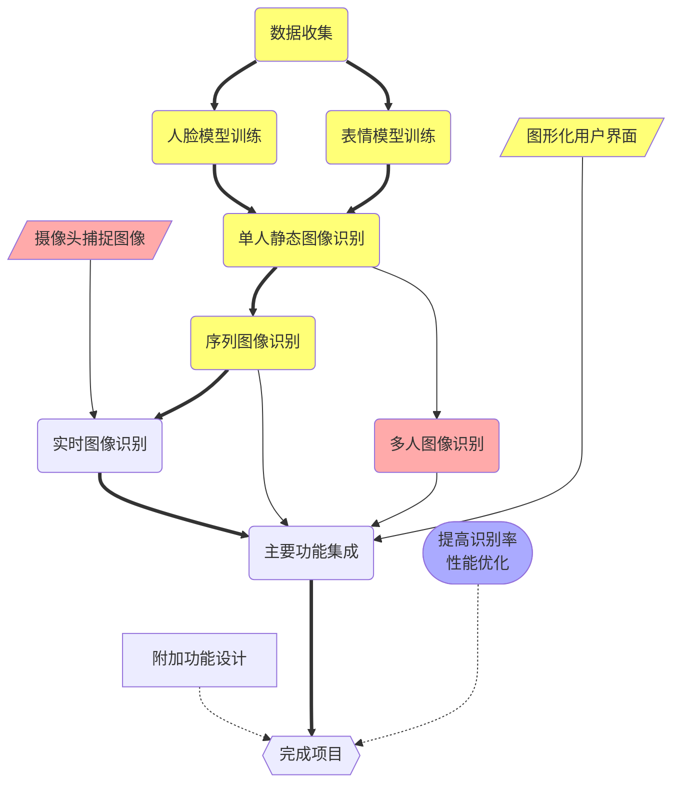

```mermaid
graph TB
H[/摄像头捕捉图像/] ---> E
A(数据收集) ==>
B(人脸模型训练) ==>
C(单人静态图像识别) ==>
D(序列图像识别) ==>
E(实时图像识别) ==>
F(主要功能集成) ===>
G{{完成项目}}
A ==> L(表情模型训练) ==>  C
C ---> J(多人图像识别) --> F
I[/图形化用户界面/] -----> F
D --> F
K([提高识别率\n性能优化]) -..-> G
附加功能设计 -.-> G
style A fill:#FF7
style B fill:#FF7
style C fill:#FF7
style D fill:#FF7
style I fill:#FF7
style L fill:#FF7
style H fill:#FAA
style J fill:#FAA
style K fill:#AAF
```
