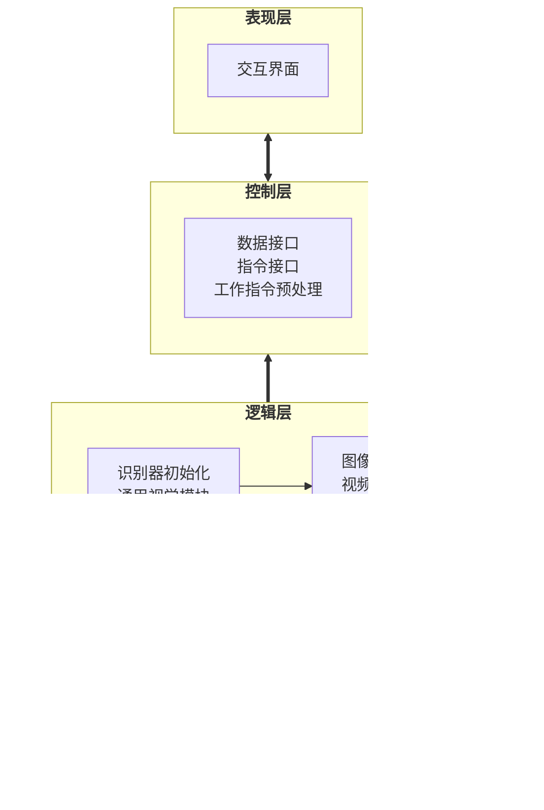

```mermaid
graph BT
T1 ==> T2 ==> T3 <==> T4

subgraph T1["`**数据层**`"]
    data[底层数据常量\n模型文件]
    utils[识别器及其控制器的抽象单例\n静态类型检查]
end
subgraph T2["`**逻辑层**`"]
    direction LR
    transform[识别器初始化\n通用视觉模块]
    recognizer[图像识别器\n视频识别器\n实时识别器]
    transform --> recognizer
end
subgraph T3["`**控制层**`"]
    controller[数据接口\n指令接口\n工作指令预处理]
end
subgraph T4["`**表现层**`"]
    main[交互界面]
end
```
